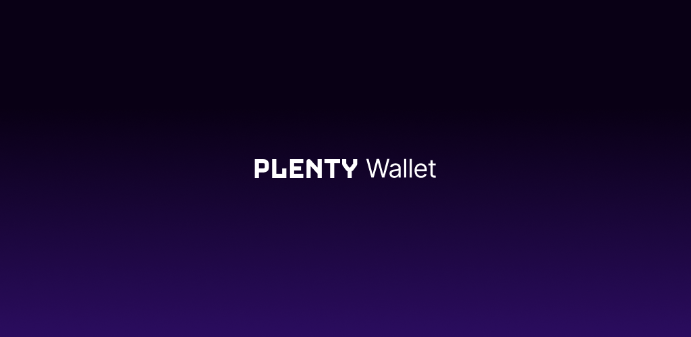
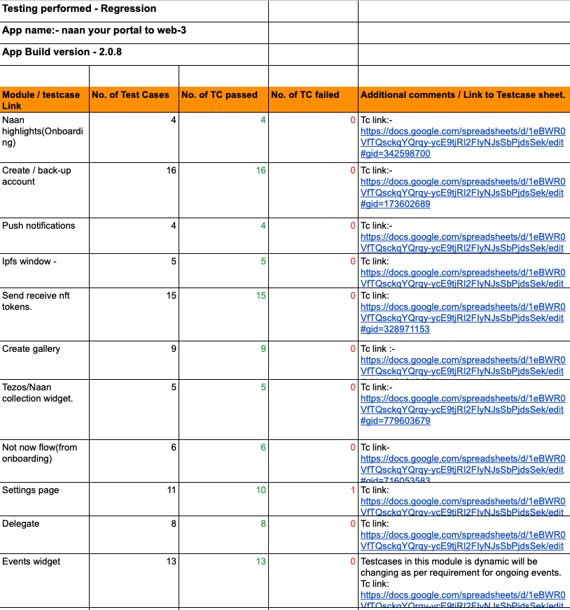

# naan - Your portal to Web3

naan is a fun, simple, and secure way to create a Tezos wallet, collect NFTs, and explore the new world of Web3 on Tezos.

## Download

- [Google Play](https://play.google.com/store/apps/details?id=com.naan&hl=en_IN&gl=US)
- [App Store](https://apps.apple.com/in/app/naan-a-tasty-tezos-wallet/id1573210354)

## Features:

- Account Management: You can create and manage multiple accounts in naan, or import existing ones from other wallets.

- Social Sign-On: You can use your social media accounts from Facebook, Google, Twitter, or Apple to create a new account in naan.

- Portfolio Management: You can track all your wallet assets and balances in one place, making it easier to manage your holdings.

- Watch Addresses: You can import and track watch addresses from various sources, including Tezos domains and tz1, tz2, and tz3 addresses.

- Token and NFT Transactions: You can send and receive tokens and NFTs easily and securely within naan.

- Personal Gallery: You can create your own gallery of NFTs and other digital assets across multiple accounts.

- Dapp Explorer: You can discover new and popular dapps on the Tezos network using the built-in Dapp Explorer.

- Delegation: You can delegate your Tezos tokens to bakers and earn rewards in a hassle-free manner.

- Testnet Support: Although tokens are not displayed due to dependency on Teztools.io, naan fully supports Tezos testnet.

- Events Section: You can stay up-to-date with upcoming events and news related to the Tezos ecosystem.

- Buy NFTs: You can purchase NFTs on Tezos using stable coins or credit cards directly within naan.

## Getting Started

This project is a starting point for a Flutter application. A few resources to get you started if this is your first Flutter project:

- Lab: [Write your first Flutter app](https://docs.flutter.dev/get-started/codelab)
- Cookbook: [Useful Flutter samples](https://docs.flutter.dev/cookbook).
- API: [Flutter API reference](https://api.flutter.dev/).
- Docs: [Flutter documentation](https://flutter.dev/docs/).

For help getting started with Flutter, view our [online documentation](https://flutter.dev/docs), which offers tutorials, samples, guidance on mobile development, and a full API reference.

## Requirements

- Flutter v3.7.x
- [Android Studio](https://developer.android.com/studio?gclid=CjwKCAjw3K2XBhAzEiwAmmgrAt5_YcC3ioQZtDywUHoioOSz6PQ4fG2VxJL_Sx3j7HKfaC3ZeHTo1BoCfWwQAvD_BwE&gclsrc=aw.ds#downloads)
- [Xcode](https://developer.apple.com/xcode/resources/)

## Install

Check if the version number is correct, and the version that requires flutter is 3.7.x the version.

```bash
flutter --version
```

The recommended version of flutter here is 3.7.7, the download address is as follows:

- [windows_3.7.7-stable](https://storage.googleapis.com/flutter_infra_release/releases/stable/windows/flutter_windows_3.7.7-stable.zip)

- [macos_3.7.7-stable](https://storage.googleapis.com/flutter_infra_release/releases/stable/macos/flutter_macos_3.7.7-stable.zip)

[Note] If your flutter version is a 1.x.xversion, please upgrade your flutter version, or you will encounter errors.

```sh
flutter upgrade
```

Run the following command to see if you need to install other dependencies to complete the installation

- To check if you have the dependencies installed

```sh
flutter doctor
```

- To get the packages

```sh
flutter pub get
```

- To run the app

```sh
flutter run // To run the app
```

- To build the app

```sh
flutter build ios // To build the app for ios
flutter build android // To build the app for android
```

- To test the app

```sh
flutter test --coverage // To test the app
```

### Build the project for iOS

Your development environment must meet the [macOS system requirements](https://docs.flutter.dev/get-started/install/macos#system-requirements) for Flutter with [Xcode installed](https://docs.flutter.dev/get-started/install/macos#install-xcode). Flutter supports iOS 9.0 and later. Additionally, you will need [CocoaPods](https://cocoapods.org/) version 1.10 or later.

Navigate to your target’s settings in Xcode:

1. Open the default Xcode workspace in your project by running open ios/Runner.xcworkspace in a terminal window from your Flutter project directory.
2. To view your app’s settings, select the Runner target in the Xcode navigator.

**Automatically manage signing**
Whether Xcode should automatically manage app signing and provisioning. This is set true by default, which should be sufficient for most apps. For more complex scenarios, see the [Code Signing Guide](https://developer.apple.com/library/content/documentation/Security/Conceptual/CodeSigningGuide/Introduction/Introduction.html).

- Installing Pods
  Use the following command to install the necessary dependencies for your project:

```sh
pod install // In your ios project directory
```

- Updating Pods

```sh
pod update // In your ios project directory
```

<br/>

## Test report
- Click here to view [doc](https://docs.google.com/spreadsheets/d/1eBWR0VfTQsckqYQrqy-ycE9tjRI2FIyNJsSbPjdsSek/edit?usp=sharing) <br/>
  
- Summary: Entire app is stable except transaction history. There are few  crashes and dapps connectivity issues, which are happening intermittently and the impact is for few users only. 
To understand all the current issues, refer issues section on this repo.
<br/>
<br/>

_NOTE:This repository is open-sourced, and is under active improvements based on suggestions and bug-reports. Users are requested to double check the transaction details on their wallet's confirmation page. The authors take no responsibility for the loss of digital assets._
